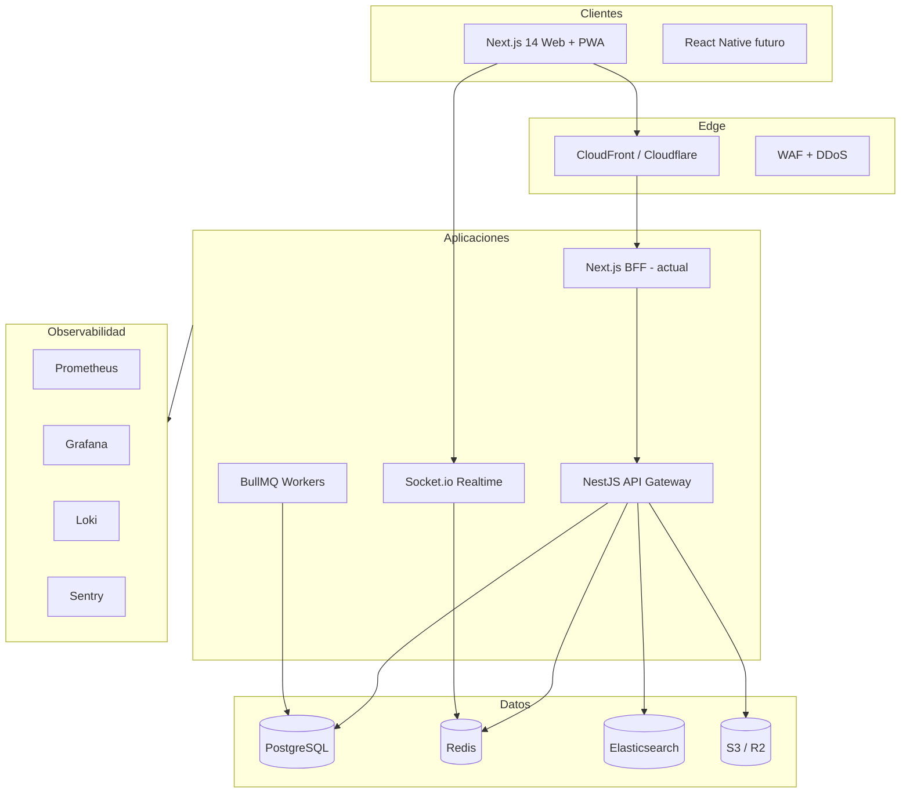

# Plataforma Enterprise Multinacional — Arquitectura Maestra

> **Codename:** Emprenor Nexus  
> **Clasificación:** Confidencial — Arquitectura CTO  
> **Versión:** 2.0 — Multi-tenant SaaS global  
> **Estado código actual:** ~30 % del alcance objetivo (núcleo operativo v1)

---

## 1. Visión ejecutiva

Construir la **infraestructura digital corporativa multinivel** más avanzada de Latinoamérica para operaciones, comunicación en tiempo real, calidad, seguridad, compliance, proyectos y gestión documental — competitiva globalmente frente a Procore, Autodesk ACC, ServiceNow y Salesforce Industry Cloud.

### Propuesta de valor

| Audiencia | Promesa |
|-----------|---------|
| **Owner global (nosotros)** | Command center absoluto: tenants, billing, seguridad, uptime, IA |
| **Empresa tenant (Nivel 2)** | “Su propia plataforma privada” white-label |
| **Cliente final (Nivel 3)** | Portal premium: proyectos, aprobaciones, evidencias, KPI |

### Referentes de producto (síntesis)

Salesforce + SAP + Procore + ServiceNow + Slack + Teams → unificado en **operaciones industriales y construcción** con compliance argentino (Ley 19.587, SRT, ART) e ISO/IRAM.

---

## 2. Modelo jerárquico multi-tenant

```
┌─────────────────────────────────────────────────────────────────┐
│ NIVEL 1 — PLATFORM OWNER (SaaS Operator)                        │
│ Rol: PLATFORM_OWNER │ Dashboard: /platform                     │
│ Datos: todos los tenants, billing global, SIEM, uptime          │
└────────────────────────────┬────────────────────────────────────┘
                             │ 1:N
┌────────────────────────────▼────────────────────────────────────┐
│ NIVEL 2 — ORGANIZATION (Tenant empresarial)                     │
│ Rol: ADMIN, especialistas, áreas corporativas                 │
│ Aislamiento: organizationId en todas las entidades de negocio  │
│ Branding: logo, colores, dominio custom                         │
└────────────────────────────┬────────────────────────────────────┘
                             │ 1:N
┌────────────────────────────▼────────────────────────────────────┐
│ NIVEL 3 — CLIENT PORTAL (Cliente del tenant)                    │
│ Rol: CLIENTE │ Proyectos asignados vía ProjectAssignment        │
│ Acceso: lectura/aprobación según RBAC                           │
└─────────────────────────────────────────────────────────────────┘
```

### Estrategia de aislamiento de datos

| Fase | Modelo | Cuándo |
|------|--------|--------|
| **MVP (ahora)** | Shared DB + `organizationId` + RLS lógica en Prisma middleware | 0–500 tenants |
| **Scale** | Schema-per-tenant (PostgreSQL schemas) | 500–5K tenants |
| **Enterprise tier** | Database-per-tenant | Clientes críticos / gobierno |

Ver detalle: [MULTI_TENANT_ARCHITECTURE.md](./MULTI_TENANT_ARCHITECTURE.md)

---

## 3. Arquitectura técnica (C4 — Contenedores)



### Principios arquitectónicos

- **Clean Architecture** + **Hexagonal** por dominio (auth, projects, documents, chat, qms, hse, billing)
- **Event-driven**: domain events → Redis Streams / SQS → workers (PDF, OCR, notificaciones)
- **Cloud-native**: 12-factor, stateless services, horizontal scale
- **API-first**: REST + GraphQL (fase 2) + OpenAPI 3.1

### Stack objetivo (alineado al brief)

| Capa | Tecnología | Estado |
|------|------------|--------|
| Frontend | Next.js 14, React, TS, Tailwind, Shadcn, Zustand, TanStack Query | ✅ Parcial |
| Backend | NestJS, GraphQL, REST | 🔲 Fase B |
| DB | PostgreSQL + Prisma | ✅ |
| Cache / RT | Redis Pub/Sub | 🔲 |
| Search | Elasticsearch | 🔲 |
| Auth | Keycloak / Auth0 + MFA | 🔲 (hoy NextAuth) |
| Storage | S3 / R2 | ✅ Parcial |
| Video | WebRTC (Daily/Livekit) | 🔲 |
| Infra | Docker, K8s, Terraform, AWS, GitHub Actions | 🔲 Doc |

---

## 4. Mapa de módulos corporativos (31 dominios)

| # | Módulo | Servicio | Prioridad | Estado v1 |
|---|--------|----------|-----------|-----------|
| 1 | Comunicación RT / Chat | `realtime-service` | P0 | Polling feed |
| 2 | Owner Command Center | `platform-service` | P0 | Scaffold `/platform` |
| 3 | Tenant dashboards | `tenant-service` | P0 | Dashboard admin |
| 4 | Client portals | `portal-service` | P0 | Dashboard cliente |
| 5 | Gestión documental (DMS) | `document-service` | P0 | Upload + categorías |
| 6 | QMS (ISO 9001 / IRAM) | `quality-service` | P1 | Informes técnicos |
| 7 | Seguridad e higiene | `hse-service` | P0 | Workers ART, IPER futuro |
| 8 | Órdenes de trabajo | `workorder-service` | P1 | Categoría docs |
| 9 | Gestión proyectos | `project-service` | P0 | Proyectos + extras |
| 10 | RRHH / Legajo | `workforce-service` | P1 | Workers parcial |
| 11 | Flota / maquinaria | `fleet-service` | P1 | Vehículos |
| 12 | Workflow / aprobaciones | `workflow-service` | P1 | Informes + extras |
| 13 | Auditoría | `audit-service` | P0 | AuditLog |
| 14 | Notificaciones | `notification-service` | P0 | In-app |
| 15 | Billing SaaS | `billing-service` | P1 | Stripe futuro |
| 16 | IA corporativa | `ai-service` | P2 | — |
| 17 | White-label | `branding-service` | P1 | TenantBranding schema |
| 18 | Dominios custom | `domain-service` | P2 | — |
| 19 | Web pública | `marketing-site` | P0 | `/(marketing)` |
| 20 | Legal / compliance | `legal-service` | P1 | Templates doc |
| 21 | Analytics global | `analytics-service` | P1 | KPIs básicos |
| 22 | SIEM / seguridad | `security-service` | P2 | — |
| 23 | Integraciones | `integration-service` | P2 | Webhooks |
| 24 | Contratistas | `contractor-service` | P2 | — |
| 25 | Finanzas | `finance-service` | P2 | Presupuesto obra |
| 26 | Compras / logística | `procurement-service` | P3 | Materiales |
| 27 | Gantt / scheduling | `schedule-service` | P2 | — |
| 28 | Export PDF/Excel | `export-worker` | P2 | — |
| 29 | Observabilidad | `observability` | P1 | Doc DevOps |
| 30 | Testing / QA | `qa-pipeline` | P1 | CI futuro |
| 31 | Documentación | `docs` | P0 | Este pack |

---

## 5. Comunicación en tiempo real (core)

### Fase 1 (actual): polling + LiveFeedEvent
### Fase 2: Socket.io + Redis adapter

```
Canal empresa → Canal cliente → Canal proyecto → DM → Hilos
```

**Entidades:** `ChatRoom`, `ChatMessage`, `ChatThread`, `MessageAttachment`, `ReadReceipt`

**Integraciones:** menciones → Notification; incidencia → Incident + chat; aprobación → Workflow

**Video:** WebRTC vía Livekit/Daily.co — salas por proyecto

---

## 6. Gestión documental enterprise

| Capacidad | Implementación |
|-----------|----------------|
| Versionado | `DocumentVersion` + checksum SHA-256 |
| OCR | AWS Textract / Tesseract worker |
| Firma digital | DocuSign API / firma local PDF |
| Vencimientos | Cron + `ExpiryAlert` (parcial hoy) |
| Clasificación IA | Embeddings + categoría sugerida |
| Búsqueda | Elasticsearch multi-tenant index |

---

## 7. QMS — Calidad (ISO 9001 / IRAM)

- Manual de calidad digital
- Procedimientos / instructivos versionados
- No conformidades → CAPA (correctiva/preventiva)
- Auditorías internas con checklist
- Matrices de requisitos vs evidencias
- KPI: % NC cerradas, tiempo CAPA, auditorías programadas

---

## 8. Seguridad e higiene (Argentina)

**Marco legal:** Ley 19.587, Dto 351/79, resoluciones SRT, ART, ATS, IPER, permisos de trabajo.

| Artefacto | Sistema |
|-----------|---------|
| Programa de seguridad | DocumentCategory + workflow |
| ATS | Formulario digital + firma |
| IPER | Matriz por proyecto |
| Incidentes | Incident + investigación |
| EPP / capacitaciones | Worker + TrainingRecord |
| Inspecciones | Checklist móvil + fotos |

---

## 9. Seguridad de plataforma (ISO 27001 ready)

| Control | Estado objetivo |
|---------|-----------------|
| TLS 1.3 | Producción obligatorio |
| AES-256 at-rest | S3 SSE-KMS |
| OAuth2 + MFA | Keycloak |
| RBAC granular | Permisos por recurso + tenant |
| Audit trail | AuditLog inmutable |
| OWASP Top 10 | SAST en CI |
| Backups | RPO 1h, RTO 4h |
| GDPR / Ley 25.326 | DPA + export/delete |

---

## 10. UX/UI — Design system «Nexus Command»

- **Tipografía:** Plus Jakarta Sans (display) + DM Sans (UI) + JetBrains Mono (datos)
- **Paleta:** Slate 950 sidebar, blue 800 primario, acentos por tenant
- **Patrones:** Command center cards, live feed, KPI monospace, dark default
- **Accesibilidad:** WCAG 2.1 AA

Wireframes: [WIREFRAMES_UX.md](./WIREFRAMES_UX.md)

---

## 11. Entregables — checklist maestro

| # | Entregable | Documento / Ruta |
|---|------------|------------------|
| 1 | Arquitectura enterprise | Este archivo |
| 2 | Multi-tenant | `MULTI_TENANT_ARCHITECTURE.md` |
| 3 | Owner dashboard | `/platform` |
| 4 | Tenant dashboards | `/dashboard` |
| 5 | Client portals | `/dashboard` (rol CLIENTE) |
| 6 | Wireframes | `WIREFRAMES_UX.md` |
| 7–8 | UI/UX + Frontend | Código + design system |
| 9–11 | Backend + APIs + RT | NestJS roadmap fase B |
| 12 | Base de datos | `prisma/schema.prisma` |
| 13–16 | DMS, QMS, HSE, RRHH | Módulos por fase |
| 17 | Billing | Stripe + `Subscription` model fase 3 |
| 18 | Branding | `TenantBranding` |
| 19 | Web pública | `app/(marketing)/` |
| 20–21 | Legal | `LEGAL_COMPLIANCE_PACK.md` + `/legal/*` |
| 22–25 | DevOps | `DEVOPS_INFRASTRUCTURE.md` |
| 26 | Seguridad | Sección 9 + pentest anual |
| 27 | Testing | Jest + Playwright CI |
| 28–29 | Docs técnica + manual | `/docs` |
| 30 | Roadmap | `GLOBAL_ROADMAP.md` |
| 31 | Producción | Go-live checklist fase 4 |

---

## 12. Migración desde Emprenor v1

1. **Semana 1–2:** `Organization` + `organizationId` + seed tenant default  
2. **Semana 3–4:** Owner `/platform` + marketing site  
3. **Mes 2:** Socket.io chat + rooms por proyecto  
4. **Mes 3:** NestJS extraction + GraphQL read API  
5. **Mes 4–6:** QMS + HSE modules + billing  
6. **Mes 6–12:** IA, Elasticsearch, K8s production

---

*Documento vivo — actualizar en cada sprint de arquitectura.*
